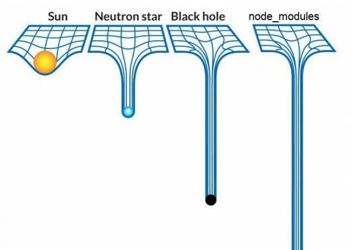

# Źródła do budowy webappek

## Co potrzeba?

Musisz mieć node.js i zainstalować dev-zależności albo standardowym

```
npm install --only=dev
```

albo, jeśli jak ja nie lubisz wolmo,

```
yarn install
```

Potem, żeby zbudować:

```
npm build.js
```

W rezultacie, w każdym podkatalogu w którym siedzą źródła danego narzędzia, znajdziesz pod-podkatalog `dst`. Siedzą tam wygenerowane narzędzia, gotowe do odpalenia w przeglądarce, albo wrzucenia na github pages, czy gdzie bądź.

## Czemu taki skrypt a nie (webpack/grunt/gulp/co tam obecnie jest modne)

Znaczy z jednej strony ja wiem o co ci chodzi i jak się projekty porozrastają może będzie trzeba pójść tą drogą, ale z drugiej strony

